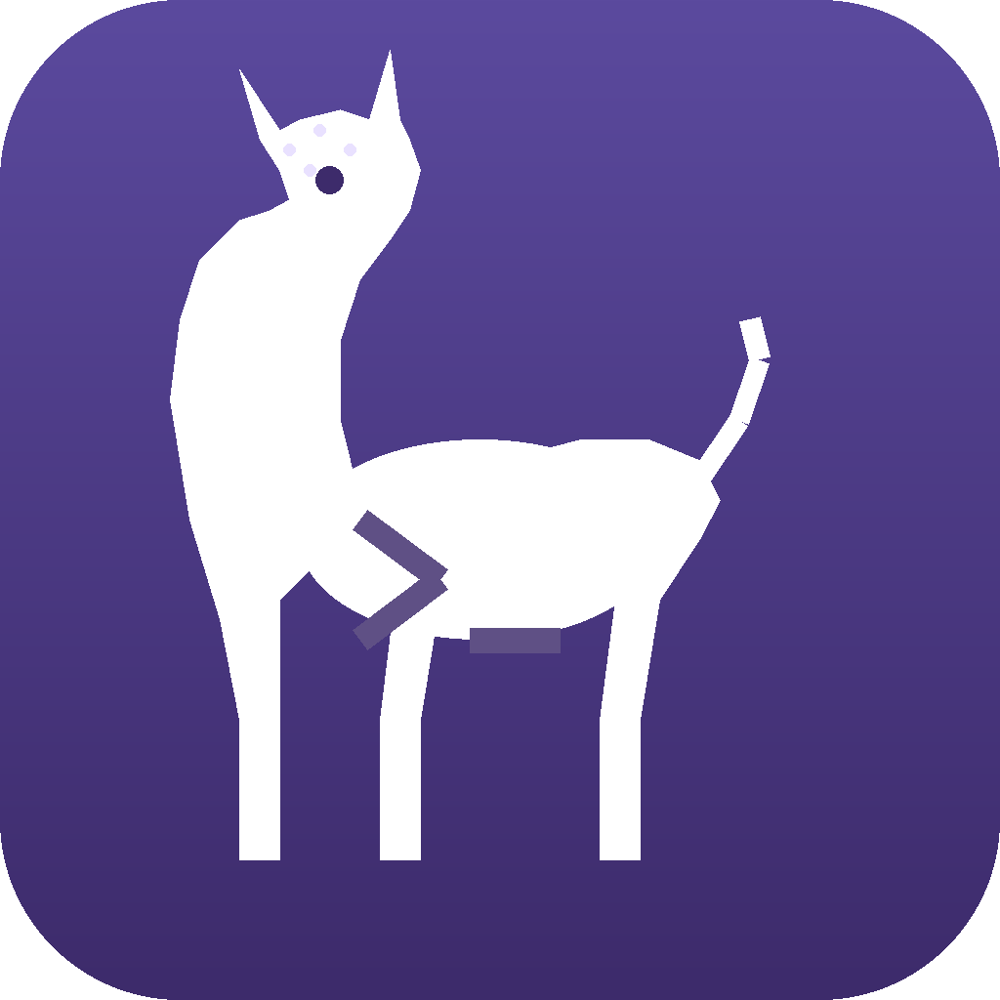
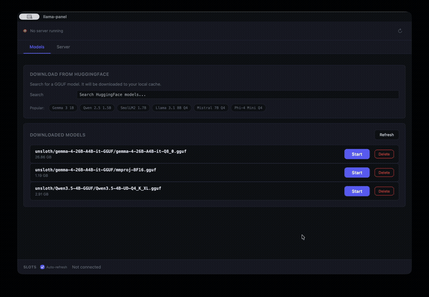
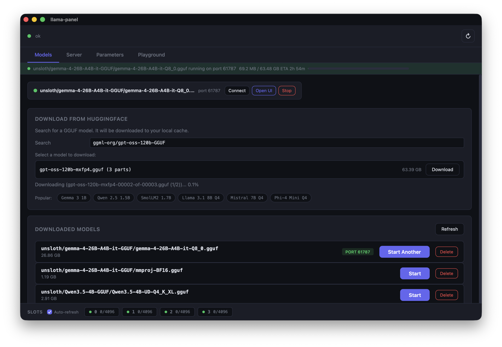
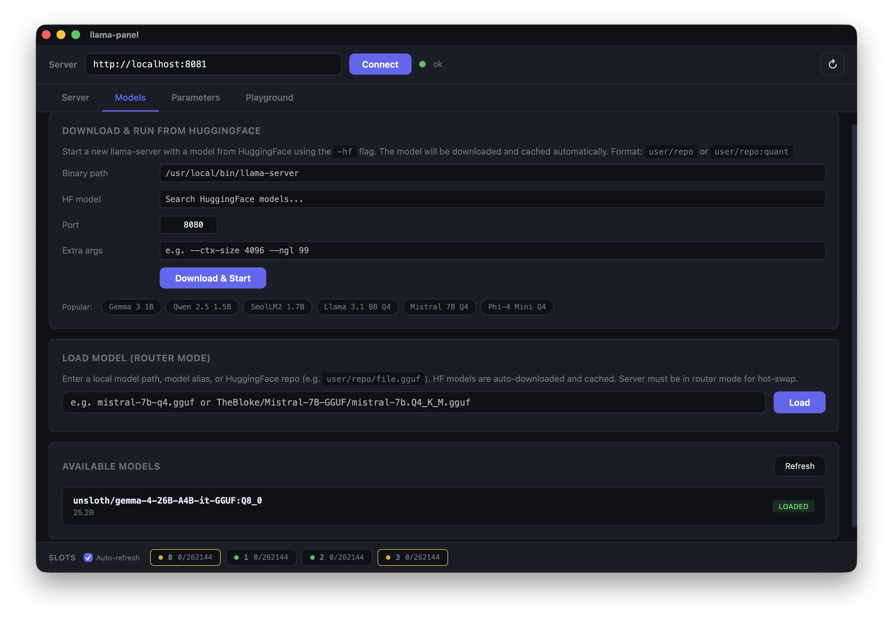
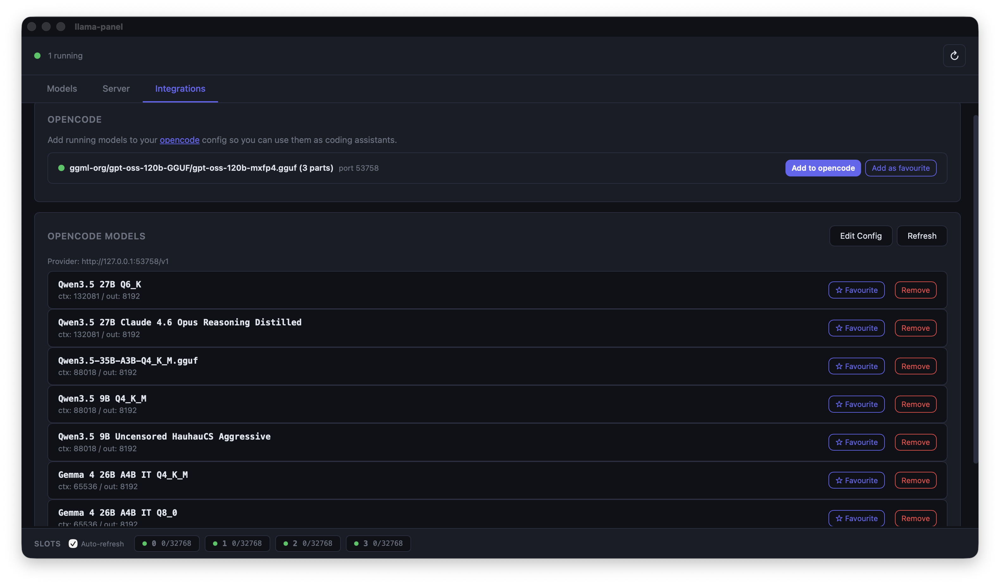

<p align="center">
  
</p>

<h1 align="center">llama-panel</h1>

<p align="center">
  A native macOS desktop app for managing and interacting with <a href="https://github.com/ggerganov/llama.cpp/tree/master/examples/server">llama-server</a> instances. Built with <a href="https://tauri.app/">Tauri</a>.
</p>

<p align="center">
  
</p>

## Features

- **Download models from HuggingFace** -- live search, automatic split-file handling, download progress with ETA
- **Run multiple servers simultaneously** -- each model gets its own random port, manage them all from one place
- **Auto-detects llama-server** -- finds the binary on your PATH or common install locations
- **Downloads to the standard HuggingFace cache** (`~/.cache/huggingface/hub/`) -- shared with `huggingface-cli`, LM Studio, and other tools
- **Open llama-server's built-in web UI** in your browser with one click
- **Configure server options** -- context size, GPU layers, flash attention, parallel slots, and more
- **Tune parameters** with interactive sliders and presets (Creative, Balanced, Precise, Deterministic)
- **Playground** for completions and chat with performance metrics
- **Live server log** -- see model loading progress, layer offloading, and errors in real time
- **Slot monitor** with real-time polling

## Model Management

Search HuggingFace for GGUF models, download them, and start serving with a few clicks. Split models (multi-file GGUFs) are detected and downloaded as a bundle automatically.

<p align="center">
  
</p>

- **Live search** -- type to search HuggingFace for GGUF models, see download counts and likes
- **Smart file picker** -- shows available quantizations with file sizes, groups split models into bundles
- **Download progress** -- real-time progress bar with ETA, visible from any tab
- **Popular model suggestions** -- quick-pick chips for Gemma, Qwen, Llama, Mistral, Phi, and more
- **Multiple servers** -- run several models at once, each on its own port. Connect, open in browser, or stop individually

## Server Configuration

Configure llama-server options from the Server tab. Settings apply when starting any model.

<p align="center">
  
</p>

- **Context & Memory** -- context size, GPU layers, batch size, flash attention
- **Slots & Parallelism** -- parallel slots, slot monitoring, continuous batching
- **Endpoints & API** -- expose properties, enable metrics, listen host
- **Server log** -- live stderr output from the running server process
- **Running servers list** -- see all active servers with stop/open/connect controls

## Integrations

- **OpenCode support** – OpenCode can connect directly to your llama-server instance via the integration panel, enabling seamless model management and inference from within the OpenCode IDE.

<p align="center">
  
</p>

## Install

### Homebrew (recommended)

```bash
brew tap AlexsJones/llama-panel
brew install llama-panel
```

This installs the `.app` bundle to `/Applications` and a `llama-panel` command on your `PATH`.

### Download from GitHub Releases

Grab the latest `.tar.gz` from [Releases](https://github.com/AlexsJones/llama-panel/releases), extract it, and drag `llama-panel.app` to `/Applications`:

```bash
tar -xzf llama-panel-v*.tar.gz
mv llama-panel.app /Applications/
```

### From source

Requires [Rust](https://rustup.rs/) and the [Tauri CLI](https://tauri.app/start/):

```bash
cargo install tauri-cli
cargo tauri build
```

The `.app` bundle will be in `target/release/bundle/macos/`.

## Usage

Launch from Spotlight, the Applications folder, or the command line:

```bash
llama-panel
```

## Development

```bash
# Install Tauri CLI
cargo install tauri-cli

# Run in dev mode (hot-reload for the UI)
cargo tauri dev
```

The frontend is vanilla HTML/CSS/JS in `ui/` -- no build step required.

## License

[MIT](LICENSE)
